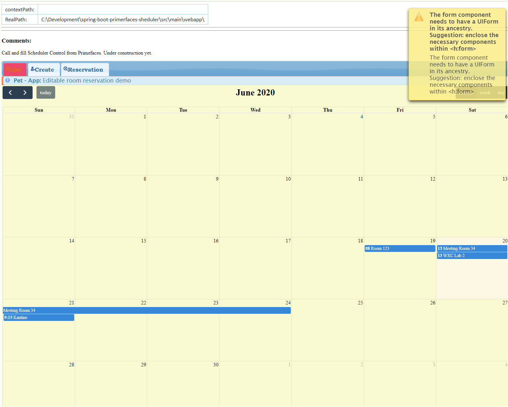

#The Project builds under Oracle JDK 14.0.1 General-Availability Release#

`Database now working under Docker https://hub.docker.com/repository/docker/senatov/postgres[repo], not local`

tags: [Spring Boot 2.3.1, JSF 2.4 (v. 2.4 not compartible to Primefaces!), Primerfaces 8.0, Spring WebMVC, JDK14]

[#_pet_project_spring_primefaces_scheduler]
*pet project:* [#spring-primefaces-scheduler#]

- implementation of Basis Primefaces Scheduler.

- Components: Spring Boot 2.3.1, JSF 2.4, Primerfaces 8.0, JSE14

- URLs:

|===
|*path are* | *description* |*remarks*

|http://localhost:8080/ui/person.xhtml
| common programm test (DB connect, Boot, JSF connection)
| helpful on refactoring and pom version changing
|===

Database: not significant, use any of them, what u've s. file://application.properties[application.properties]
for the info!
mailto://javaentwickler@gmail.com[EMail]

