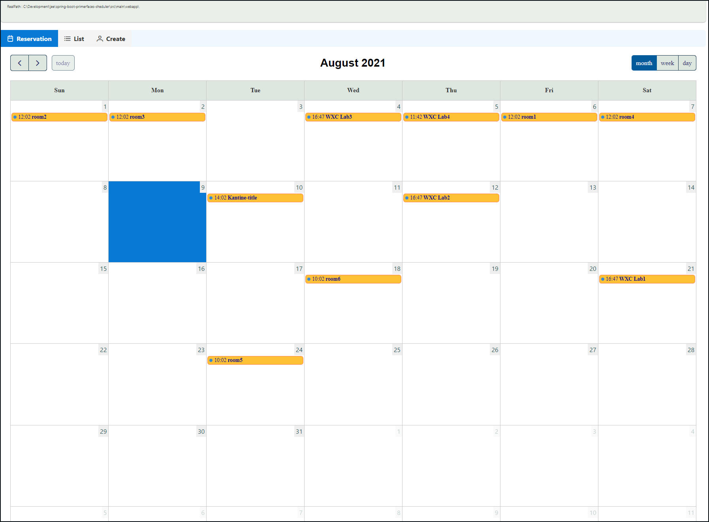
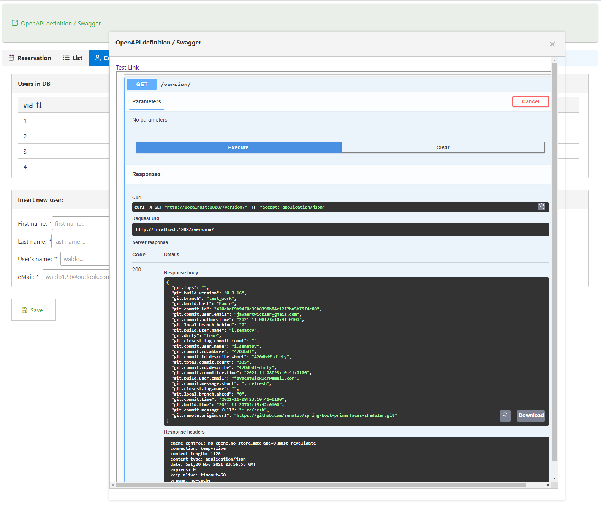

## Spring Boot Integration example

- example code.
- `The Project builds under Oracle JDK16 General-Availability Release`

Tags:
****
> JDK16  
> JPA/Hibernate  
> Postgres:latest under Docker 
> Spring-Boot 2.5.4 
> JSF2 Mojarra  
> PrimeFaces 10.0 
***
- implementation of Basis Primefaces Scheduler.
- Components: JDK16, JPA/Hibernate, Docker + Postgres, Spring-Boot 2.5.4,   JSF2 Mojarra, PrimeFaces 10, Spring Security-NO
- URLs: [http://localhost:18087/ui/reservation.xhtml](http://localhost:18087/ui/reservation.xhtml)
- GITH Info from Rest WS: [http://localhost:18087/version](http://localhost:18087/version)
***
**[Start Link](http://localhost:18087/ui/reservation.xhtml)**.

common programm test (DB connect, Boot, JSF connection) is helpful on  
refactoring and pom version changing

**[EMail:javaentwickler@gmail.com](mailto://javaentwickler@gmail.com)**
***

