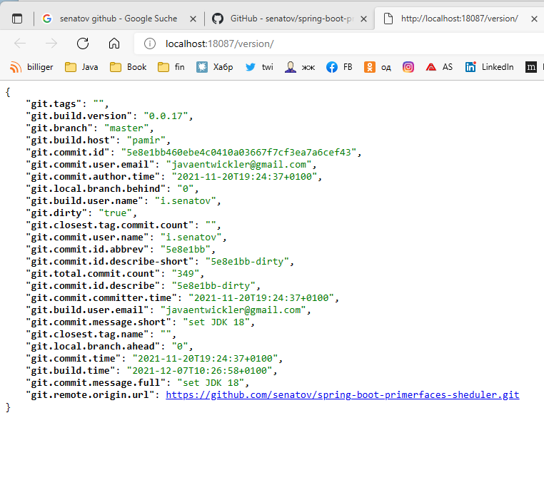

# Spring Boot Integration example

- `The Project builds under LibericaJDK-17-Full General-Availability Release`

**

**Tags:**

> LibericaJDK-17-Full 
> JPA/Hibernate  
> Postgres:latest under Docker 
> [Spring-Boot 2.6.2-SNAPSHOT]([s. specs](https://docs.spring.io/spring-boot/docs/2.6.2-SNAPSHOT/)) 
> JSF 2.4.0 Mojarra  
> PrimeFaces 11
>  
>  

---

- implementation of Basis Primefaces Scheduler.
- Components: JDK 17, JPA/Hibernate, Postgres DB under Docker, Spring-Boot 2.6.1,   JSF 2.4.0 Mojarra,
- PrimeFaces 11.0.0, Spring Security: .headers().frameOptions().sameOrigin()
- URLs: [http://localhost:18087/ui/reservation.xhtml](http://localhost:18087/ui/reservation.xhtml)
- GITH Info from Rest WS: [http://localhost:18087/version](http://localhost:18087/version)

---

**[Start Link](http://localhost:18087/ui/reservation.xhtml)**.

common programm test (DB connect, Boot, JSF connection) is helpful on  
refactoring and pom version changing

**[EMail:javaentwickler@gmail.com](mailto://javaentwickler@gmail.com)**

---

